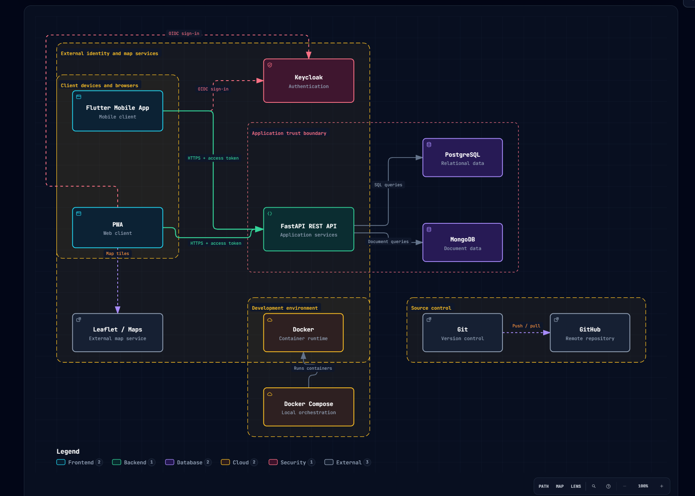

# Práctica 02 - Boceto de Arquitectura del Proyecto Integrador

Repositorio de prácticas de la materia **Integradora**.

El objetivo de esta práctica es instalar y configurar **Archify** como agente de modelado arquitectónico, utilizarlo mediante **Codex** con inteligencia artificial y generar un primer boceto interactivo de la arquitectura del Proyecto Integrador.

[Diagrama de Arquitectura]()

**Evidencia:**


## Actividades realizadas

- Verificación de la instalación de NPM.
- Instalación de Codex CLI.
- Instalación de Archify.
- Vinculación de la cuenta de Codex con ChatGPT.
- Ingreso del prompt para generar el modelo arquitectónico.
- Generación del diagrama de arquitectura interactivo en HTML.
- Carga de los documentos generados en la rama `Practica02`.
- Realización de commits utilizando buenas prácticas.
- Publicación de los cambios en el repositorio remoto.
- Habilitación de GitHub Pages para consultar el modelo interactivo.
- Elaboración del documento de evidencias en PDF.
- Actualización de la tabla de prácticas con la Práctica 02.
- Fusión de la rama `Practica02` con `main`.

## Prompt utilizado

```text
Use Archify to create an initial interactive architecture diagram.

System:
Flutter Mobile App
    -> Keycloak Authentication
    -> FastAPI REST API
        -> PostgreSQL
        -> MongoDB
    -> Leaflet / Maps Service

Development environment:
    -> Docker
    -> Docker Compose

Source control:
    -> Git
    -> GitHub

Show:
- Mobile client
- Authentication layer
- API layer
- Data layer
- External services
- Development infrastructure
- Main request/data flows
- Trust boundaries

Use an architecture diagram.
Generate it as interactive HTML.
```