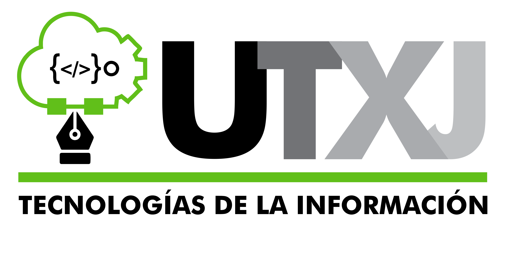
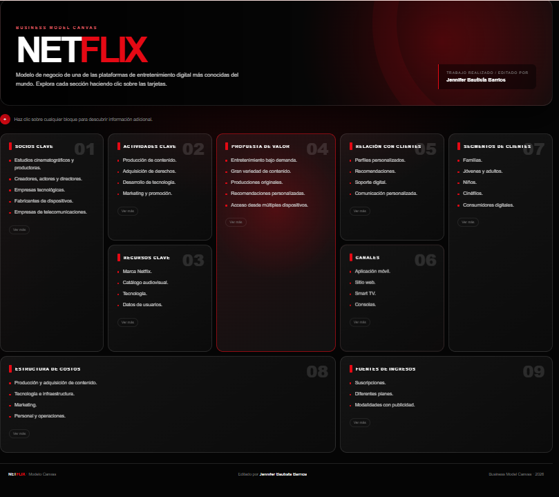

#           🌸 Netflix | Modelo Canvas 🎬

<p align="center">
  
</p>

<p align="center">
  💗✨ <strong>Modelo de Negocio de Netflix</strong> ✨💗
</p>

<p align="center">
  Representación visual mediante el Business Model Canvas
</p>

---

## 💕 Modelo Canvas

🔗 **[✨ Ver Modelo Canvas de Netflix ✨](https://jenniferbautistabarrios.github.io/Practicas-Integradora/Practica03/index.html)**

<p align="center">
  
</p>

---

## 🌷 Descripción

Este proyecto presenta una representación visual del **modelo de negocio de Netflix** utilizando el marco de trabajo **Business Model Canvas**.

El objetivo es organizar de manera clara los principales elementos que forman parte del modelo de negocio de la plataforma, permitiendo identificar cómo se relacionan sus diferentes componentes.

La información se presenta mediante una cuadrícula dividida en **nueve bloques principales**, facilitando la lectura y consulta de cada apartado.

---

## 🎀 Componentes del Canvas

El modelo está compuesto por los siguientes elementos:

### 🌸 Socios clave

Representa a los principales socios que participan en el funcionamiento de Netflix, incluyendo productores de contenido, estudios cinematográficos, empresas tecnológicas, proveedores de infraestructura y socios comerciales.

### 🎬 Actividades clave

Incluye las actividades necesarias para mantener el funcionamiento de la plataforma, como la producción y adquisición de contenido, desarrollo de la plataforma, distribución de contenido y personalización de la experiencia de los usuarios.

### 💎 Recursos clave

Reúne los recursos utilizados por Netflix para ofrecer su servicio, como su catálogo de contenido, producciones originales, tecnología, plataforma digital, infraestructura y datos de los usuarios.

### 💗 Propuesta de valor

Presenta los principales beneficios que Netflix ofrece a sus usuarios, como el acceso a películas, series, documentales y contenido original mediante una plataforma de streaming, con recomendaciones personalizadas y diferentes opciones de suscripción.

### 🤝 Relación con clientes

Representa la manera en que Netflix mantiene la relación con sus usuarios mediante recomendaciones personalizadas, gestión de cuentas, soporte al cliente, perfiles y diferentes opciones de suscripción.

### 📱 Canales

Muestra los diferentes medios mediante los cuales los usuarios pueden acceder a Netflix, como aplicaciones para dispositivos móviles, televisores inteligentes, computadoras, tabletas, consolas de videojuegos y reproductores compatibles.

### 👥 Segmentos de clientes

Identifica los principales grupos que utilizan la plataforma, incluyendo usuarios individuales, familias, estudiantes, hogares y personas interesadas en contenido de entretenimiento por streaming.

### 💰 Estructura de costos

Representa los principales costos relacionados con el funcionamiento de Netflix, incluyendo producción y adquisición de contenido, infraestructura tecnológica, desarrollo de la plataforma, marketing, personal y operaciones.

### 💵 Fuentes de ingresos

Presenta las principales formas mediante las cuales Netflix obtiene ingresos, principalmente mediante suscripciones de los usuarios a sus diferentes planes y otras modalidades comerciales disponibles en determinados mercados.

---

## 💕 Características del proyecto

El Modelo Canvas cuenta con una interfaz diseñada para facilitar la visualización de la información.

Entre sus principales características se encuentran:

- 🌸 **Diseño visual:** los nueve componentes están organizados mediante tarjetas.
- 🖱️ **Interacción:** al pasar el cursor sobre una tarjeta se puede visualizar información ampliada.
- ⌨️ **Accesibilidad:** las tarjetas pueden enfocarse mediante el teclado.
- 📱 **Diseño adaptable:** la interfaz se ajusta a computadoras, tabletas y dispositivos móviles.
- 🖨️ **Impresión:** el contenido puede visualizarse correctamente al imprimir.
- 💗 **Interfaz organizada:** cada sección permite identificar rápidamente su contenido.

---

## 🛠️ Tecnologías utilizadas

Para desarrollar esta práctica se utilizaron tecnologías web básicas:

| Tecnología | Función |
|---|---|
| 🌐 **HTML5** | Estructura y contenido de la página |
| 🎨 **CSS3** | Diseño visual, colores y efectos |
| 📱 **Responsive Design** | Adaptación a diferentes dispositivos |
| 🚀 **GitHub Pages** | Publicación del proyecto |

El proyecto no requiere librerías externas ni instalaciones adicionales para poder visualizarse.

---

## 📂 Estructura del proyecto

```text
Practica03/
│
├── 📄 index.html
├── 🖼️ Netflix-model-canvas.png
└── 📄 README.md
