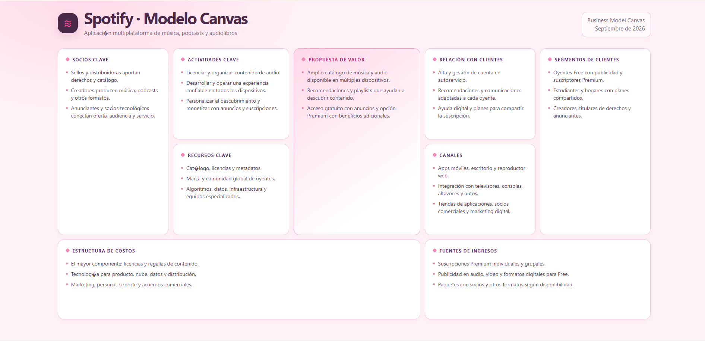

#           🌸 Spotify | Modelo Canvas 🎧

<p align="center">
  
</p>

<p align="center">
  💗✨ <strong>Modelo de Negocio de Spotify</strong> ✨💗
</p>

<p align="center">
  Representación visual mediante el Business Model Canvas
</p>

---

## 💕 Modelo Canvas

🔗 **[✨ Ver Modelo Canvas de Spotify ✨](https://jenniferbautistabarrios.github.io/Practicas-Integradora/Practica03/index.html)**

<p align="center">
  
</p>

---

## 🌷 Descripción

Este proyecto presenta una representación visual del **modelo de negocio de Spotify** utilizando el marco de trabajo **Business Model Canvas**.

El objetivo es organizar de manera clara los principales elementos que forman parte del modelo de negocio de la plataforma, permitiendo identificar cómo se relacionan sus diferentes componentes.

La información se presenta mediante una cuadrícula dividida en **nueve bloques principales**, facilitando la lectura y consulta de cada apartado.

---

## 🎀 Componentes del Canvas

El modelo está compuesto por los siguientes elementos:

### 🌸 Socios clave

Representa a los principales socios que participan en el funcionamiento de Spotify, incluyendo distribuidores, creadores, anunciantes y socios tecnológicos.

### 🎵 Actividades clave

Incluye las actividades necesarias para mantener el funcionamiento de la plataforma, como la gestión del contenido, el desarrollo del servicio y la personalización de la experiencia.

### 💎 Recursos clave

Reúne los recursos utilizados por Spotify para ofrecer su servicio, como el catálogo, las licencias, la tecnología, los datos y la infraestructura.

### 💗 Propuesta de valor

Presenta los principales beneficios que Spotify ofrece a sus usuarios, como el acceso a contenido de audio, recomendaciones personalizadas, playlists y diferentes opciones de acceso al servicio.

### 🤝 Relación con clientes

Representa la manera en que Spotify mantiene la relación con sus usuarios mediante la gestión de cuentas, recomendaciones, comunicación, soporte y opciones de suscripción.

### 📱 Canales

Muestra los diferentes medios mediante los cuales los usuarios pueden acceder a la plataforma, como aplicaciones móviles, escritorio, reproductor web y otros dispositivos compatibles.

### 👥 Segmentos de clientes

Identifica los principales grupos que utilizan o participan en la plataforma, incluyendo usuarios gratuitos, suscriptores Premium, estudiantes, hogares, creadores, titulares de derechos y anunciantes.

### 💰 Estructura de costos

Representa los principales costos relacionados con el funcionamiento de Spotify, incluyendo licencias, infraestructura tecnológica, desarrollo, marketing y operaciones.

### 💵 Fuentes de ingresos

Presenta las principales formas mediante las cuales Spotify obtiene ingresos, principalmente mediante suscripciones Premium y publicidad.

---

## 💕 Características del proyecto

El Modelo Canvas cuenta con una interfaz diseñada para facilitar la visualización de la información.

Entre sus principales características se encuentran:

- 🌸 **Diseño visual:** los nueve componentes están organizados mediante tarjetas.
- 🖱️ **Interacción:** al pasar el cursor sobre una tarjeta se puede visualizar información ampliada.
- ⌨️ **Accesibilidad:** las tarjetas pueden enfocarse mediante el teclado.
- 📱 **Diseño adaptable:** la interfaz se ajusta a computadoras, tabletas y dispositivos móviles.
- 🖨️ **Impresión:** el contenido puede visualizarse correctamente al imprimir.
- 💗 **Interfaz organizada:** cada sección permite identificar rápidamente su contenido.

---

## 🛠️ Tecnologías utilizadas

Para desarrollar esta práctica se utilizaron tecnologías web básicas:

| Tecnología | Función |
|---|---|
| 🌐 **HTML5** | Estructura y contenido de la página |
| 🎨 **CSS3** | Diseño visual, colores y efectos |
| 📱 **Responsive Design** | Adaptación a diferentes dispositivos |
| 🚀 **GitHub Pages** | Publicación del proyecto |

El proyecto no requiere librerías externas ni instalaciones adicionales para poder visualizarse.

---

## 📂 Estructura del proyecto

```text
Practica03/
│
├── 📄 index.html
├── 🖼️ spotify-model-canvas.png
└── 📄 README.md