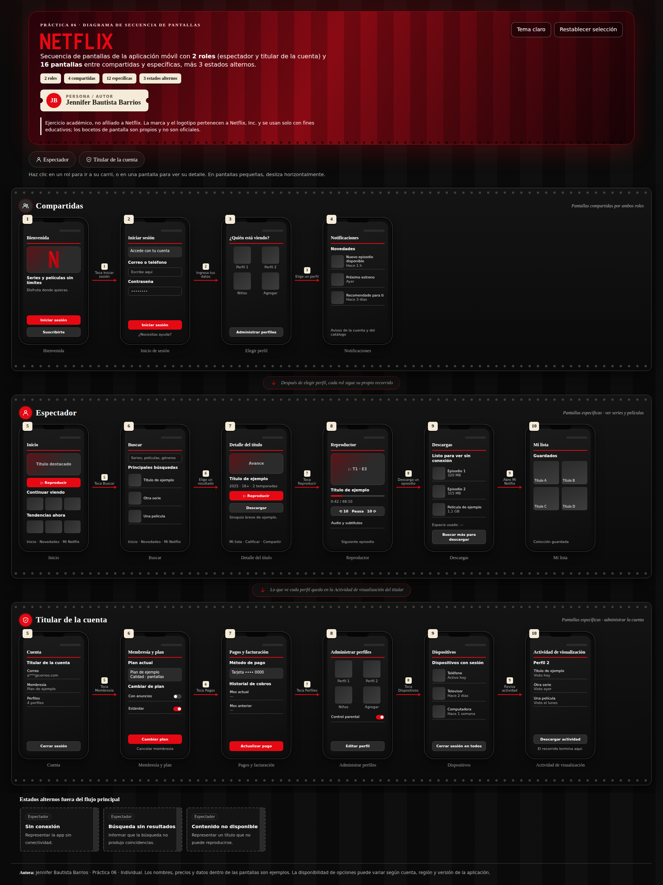

# Práctica 06 – Diagrama de Secuencia de Pantallas (Sketches) de Netflix

**Persona / Autor:** Jennifer Bautista Barrios · Modalidad individual

Diagrama interactivo de **secuencia de pantallas** de la aplicación móvil de **Netflix**, con **2 roles** (espectador y titular de la cuenta) y **16 pantallas** entre compartidas y específicas, más 3 estados alternos. Cada pantalla es clicable y abre un panel con su propósito, sus elementos y la acción siguiente.

**[Ver el diagrama en GitHub Pages](https://jffa25.github.io/Practicas_Integradora_230417/Practica06/netflix-secuencia-pantallas.html)**



<p align="center"></p>

## Pantallas (16 + 3 estados alternos)

| Carril | Pantallas |
|---|---|
| **Compartidas** (4) | 1 Bienvenida · 2 Inicio de sesión · 3 Elegir perfil · 4 Notificaciones |
| **Espectador** (6) | 5 Inicio · 6 Buscar · 7 Detalle del título · 8 Reproductor · 9 Descargas · 10 Mi lista |
| **Titular de la cuenta** (6) | 5 Cuenta · 6 Membresía y plan · 7 Pagos y facturación · 8 Administrar perfiles · 9 Dispositivos · 10 Actividad de visualización |
| **Estados alternos** (3) | Sin conexión · Búsqueda sin resultados · Contenido no disponible |

Las flechas numeradas indican la acción que lleva a la siguiente pantalla (por ejemplo, "Toca Reproducir"). Una flecha entre carriles muestra que lo que ve cada perfil queda en la **Actividad de visualización** del titular.

## Nota académica

Ejercicio académico, no afiliado a Netflix. La marca y el logotipo pertenecen a Netflix, Inc. y se usan solo con fines educativos. Los archivos `netflix-logo.svg` y `netflix-icon.svg` son una recreación vectorial hecha para esta práctica, no los archivos oficiales. Los bocetos de pantalla son propios y de baja fidelidad; los nombres y datos son ejemplos.

## Prompt usado con Archify

```
Usa Archify para generar el Diagrama de Secuencia de Pantallas (Sketches) de la aplicación móvil de Netflix, con 2 roles: espectador y titular de la cuenta, y al menos 15 pantallas entre compartidas y específicas.

- Carril "Compartidas": bienvenida, inicio de sesión, elegir perfil, notificaciones.
- Carril "Espectador": inicio, buscar, detalle del título, reproductor, descargas, Mi lista.
- Carril "Titular de la cuenta": cuenta, membresía y plan, pagos y facturación, administrar perfiles, dispositivos, actividad de visualización.
- Flechas numeradas con la acción que dispara cada cambio, y una flecha entre carriles (la actividad de cada perfil llega al titular).
- Estados alternos: sin conexión, búsqueda sin resultados y contenido no disponible.
- Interacción: panel de detalle por pantalla, selección de rol con desplazamiento al carril, tema claro/oscuro y restablecer.
- Paleta de Netflix (#E50914, #141414), accesible (teclado, foco visible, aria-live, prefers-reduced-motion) y responsive.
Salida: un HTML autocontenido para GitHub Pages.
```

## Revisión del resultado

- 2 roles y al menos 15 pantallas (compartidas y específicas): sí (16 + 3 alternos)
- Flechas numeradas con acción, estados alternos y flecha entre carriles: sí
- Logotipo de Netflix, paleta, tema claro/oscuro: sí
- Se ve bien en celular real y en GitHub Pages: por confirmar al publicar

## Persona / Autor

- **Jennifer Bautista Barrios**
