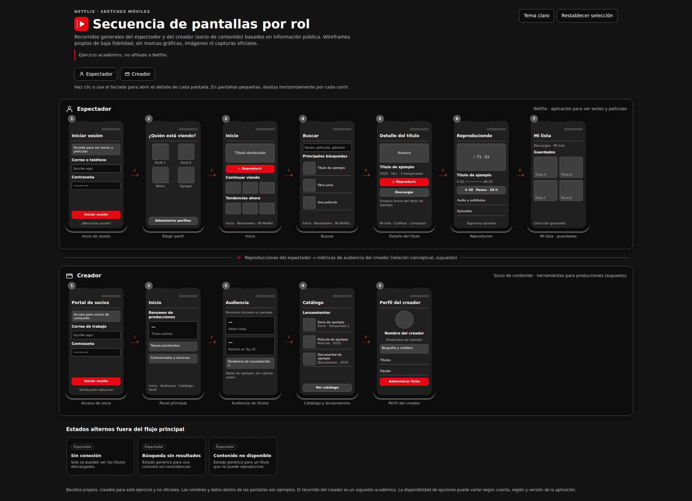

# Práctica 06 – Diagrama de Secuencia de Pantallas (Sketches) de Netflix

Diagrama interactivo de **secuencia de pantallas (sketches)** de la aplicación móvil de **Netflix** con **2 roles**: espectador y creador (socio de contenido). Cada pantalla es clicable y abre un panel con su propósito, sus elementos de interfaz y la acción que lleva a la siguiente pantalla.

**[Ver el diagrama en GitHub Pages](https://jffa25.github.io/Practicas_Integradora_230417/Practica06/netflix-secuencia-pantallas.html)**

### Diagrama de Secuencia de Pantallas - Netflix



### Nota académica

Este trabajo es un ejercicio académico. Los bocetos son de baja fidelidad y **no son las pantallas oficiales** de Netflix; el logotipo es propio, inspirado en la idea de reproducción de video, y no está afiliado a Netflix. Solo se usó la paleta de colores como referencia visual. El recorrido del rol **creador** es un **supuesto académico**, porque Netflix no publica una aplicación móvil para creadores.

## Netflix

<p align="center">
  
</p>

Netflix es una plataforma de streaming de series, películas y documentales. Para esta práctica se eligió porque tiene dos recorridos claros: el **espectador**, que elige perfil, busca, reproduce y guarda títulos, y el **creador** (socio de contenido), que consulta la audiencia de sus títulos y gestiona su catálogo. El diagrama muestra cómo avanza cada rol de pantalla en pantalla y cómo las reproducciones del espectador alimentan las métricas de audiencia del creador.

## Archivos

| Archivo | Descripción |
|---|---|
| `netflix-secuencia-pantallas.html` | Diagrama interactivo (HTML autocontenido, listo para GitHub Pages) |
| `netflix-pantallas.sequence.json` | Descripción de la secuencia en formato Archify |
| `netflix-logo-propio.svg` | Logotipo propio |
| `netflix-secuencia-pantallas.visual-check.*` | Capturas (claro/oscuro) y evidencia de la verificación visual |

## Evolución de los prompts

| Versión | Qué pidió | Qué corrigió después |
|---|---|---|
| v1 | Diagrama de secuencia de pantallas con 2 roles (espectador y creador), bocetos de baja fidelidad, flechas numeradas, estados alternos e interacción | Faltaba la identidad visual de la aplicación elegida |
| v2 | Aplicar la paleta de colores inspirada en Netflix y crear un logotipo propio, sin cambiar las pantallas | Los botones de rol solo resaltaban el recorrido, sin llevar al carril correspondiente |
| v3 | Navegación al seleccionar un rol: desplazamiento suave hasta su carril, realce breve, foco accesible y respeto de `prefers-reduced-motion` | Capturas claro/oscuro idénticas, rutas rotas en el README y pantallas con texto fuera del marco |
| v4 | Corregir el trabajo: verificar contención de textos, panel accesible, botón de restablecer y rutas relativas | Versión final |

<details>
<summary>Prompt v1 — Diagrama de secuencia de pantallas</summary>

```
Usa Archify para generar el Diagrama de Secuencia de Pantallas (Sketches) de la aplicación móvil de Netflix, mostrando el recorrido de 2 roles: espectador y creador.

Alcance y fidelidad:
- Representa pantallas típicas y reconocibles de cada rol con bocetos propios de baja fidelidad (wireframes en escala de grises). No uses logotipos, capturas ni fotografías oficiales de Netflix.
- Basa el contenido solo en funciones públicas y generales de la aplicación; no inventes funciones. Marca como "supuesto" cualquier pantalla que no sea segura (por ejemplo, el recorrido del creador).
- Indica en una nota que es un ejercicio académico y que los bocetos no son las pantallas oficiales.

Estructura del diagrama:
- Dos carriles horizontales (uno por rol), con el nombre y el ícono de cada rol.
- Cada carril contiene los bocetos de las pantallas dentro de marcos de teléfono, en el orden del recorrido.
- Rol espectador: inicio de sesión → elegir perfil → inicio → buscar → detalle del título → reproductor → Mi lista (guardados).
- Rol creador: acceso de socio → panel principal → audiencia de títulos → catálogo y lanzamientos → perfil del creador.
- Flechas numeradas entre pantallas, con una etiqueta breve de la acción que dispara el cambio (por ejemplo "Toca Reproducir").
- Pantallas de estados alternos fuera del flujo principal: sin conexión, búsqueda sin resultados y contenido no disponible.
- Una flecha entre carriles que muestre cómo las reproducciones del espectador alimentan las métricas de audiencia del creador.

Interacción:
- Al hacer clic en una pantalla, se abre un panel con su nombre, propósito, elementos de la interfaz y la acción que lleva a la siguiente pantalla.
- Al seleccionar un rol, se resalta su recorrido y se atenúa el otro.
- Botones para alternar tema claro/oscuro y para restablecer la selección.

Diseño y código:
- Una página HTML autocontenida, responsive, con desplazamiento horizontal en pantallas pequeñas.
- Accesible: controles operables con teclado, aria-pressed, foco visible, textos alternativos y soporte para prefers-reduced-motion.
- Cursor tipo enlace en los elementos clicables, sin selección de texto.
- Cada pantalla debe tener elementos distintos entre sí (no repitas el mismo boceto con otro título).
- Verifica que ningún texto se salga de los marcos de las pantallas.

Salida: un archivo HTML listo para subir a GitHub Pages.
```
</details>

<details>
<summary>Prompt v2 — Paleta de colores y logotipo</summary>

```
Conserva exactamente las pantallas, el orden del recorrido, las flechas, los textos y la interacción actual del diagrama. Ajusta únicamente el estilo visual:

Paleta de colores (inspirada en Netflix):
- Rojo de acento #E50914 para botones principales, flechas activas, rol seleccionado y elementos destacados.
- Negro #141414 y #0B0B0B para el fondo del diagrama y los marcos de teléfono.
- Grises #221F1F y #404040 para tarjetas y bloques, y #B3B3B3 para textos secundarios.
- Blanco #FFFFFF para textos principales.
- Usa el rojo con moderación, solo como acento, y verifica que el contraste de los textos sea de al menos 4.5:1.
- Tema oscuro por defecto, con el botón para alternar al tema claro (adapta la paleta clara con los mismos acentos rojos).

Logotipo:
- Crea un logotipo propio en SVG inline para el encabezado y el favicon: un cuadrado redondeado rojo con un símbolo de reproducción y perforaciones de película.
- No copies ni trates de reproducir el logotipo oficial (la letra N), ni uses su tipografía de marca. Evita incluir el nombre "Netflix" dentro del logotipo.
- Mantén el texto del título del diagrama junto al logotipo y agrega una nota breve: "Ejercicio académico, no afiliado a Netflix".

Verificaciones:
- Comprueba que ningún texto se salga de los marcos ni de las tarjetas después del cambio de colores.
- Mantén el cursor tipo enlace, el foco visible, la accesibilidad y prefers-reduced-motion.

Salida: el mismo archivo HTML actualizado.
```
</details>

<details>
<summary>Prompt v3 — Navegación al seleccionar un rol</summary>

```
Conserva exactamente el diseño, los colores, las pantallas, las flechas y la interacción actual. Agrega únicamente navegación al seleccionar un rol:

- Al hacer clic en el botón "Espectador" o "Creador", además de resaltar su recorrido, desplázate suavemente hasta el carril de ese rol para que sus pantallas queden visibles.
- Si el carril ya está visible en pantalla, no hagas scroll innecesario.
- Deja un margen superior para que el título del carril no quede pegado al borde ni tapado por ningún encabezado fijo.
- Si el diagrama se desplaza horizontalmente en pantallas pequeñas, lleva también el scroll horizontal al inicio del recorrido del rol (la primera pantalla).
- Aplica un destello o realce breve (por ejemplo, un contorno rojo que se desvanece en 1 segundo) en el carril al llegar.
- Mueve el foco al encabezado del carril, con tabindex="-1", y anuncia el cambio con una región aria-live (por ejemplo, "Mostrando el recorrido del creador").
- Respeta prefers-reduced-motion: si está activo, desplázate sin animación y sin destello.
- Si se vuelve a hacer clic en el mismo rol, repite el desplazamiento y no quites el resaltado.
- El botón "Restablecer selección" debe quitar el resaltado sin mover la vista.
- No uses librerías externas; usa scrollIntoView con behavior "smooth" o equivalente.

Verificaciones:
- Pruébalo con el diagrama en escritorio y en móvil, y con navegación por teclado.
- Comprueba que ningún texto se salga de los marcos y que el cursor siga siendo tipo enlace.

Salida: el mismo archivo HTML actualizado.
```
</details>

<details>
<summary>Prompt v4 — Corrección de la práctica</summary>

```
Corrige la práctica 06 sin cambiar su estructura:
- Verifica con un navegador que ningún texto ni elemento se salga de los marcos de las pantallas, en tema claro y oscuro y en escritorio y móvil.
- Regenera las capturas: la versión clara y la oscura deben ser distintas.
- Haz que el panel de detalle atrape el foco, se cierre con Escape y devuelva el foco a la pantalla que lo abrió.
- Haz que "Restablecer selección" quite solo el resaltado de rol, sin cambiar el tema.
- Usa rutas relativas en el README y agrega el logotipo como archivo SVG.
- Actualiza el contenido y la paleta para que corresponda a Netflix.

Salida: HTML, JSON de secuencia, README y capturas actualizados.
```
</details>

## Revisión del resultado

- 2 roles con su recorrido de pantallas (espectador y creador): sí
- Bocetos de baja fidelidad con flechas numeradas y estados alternos: sí
- Paleta de colores inspirada en Netflix y logotipo propio: sí
- Interacción por pantalla (panel de detalle, resaltado por rol, tema claro/oscuro): sí
- Los botones de rol llevan al carril correspondiente (scroll, foco y aria-live): sí, probado en Chromium
- Ningún texto se sale de los marcos (escritorio 1440 y 2048, móvil 390, claro y oscuro): sí, ver `netflix-secuencia-pantallas.visual-check.json`
- Se ve bien en un celular real: por confirmar (probado solo con un viewport móvil emulado)
- Rutas configuradas para funcionar bien en GitHub Pages: por confirmar al publicar

## Descripción del diagrama

El diagrama organiza las pantallas en dos carriles, uno por rol, dentro de marcos de teléfono:

- **Espectador**: inicio de sesión, elegir perfil, inicio, buscar, detalle del título, reproductor y Mi lista con los títulos guardados.
- **Creador (supuesto)**: acceso de socio, panel principal, audiencia de títulos, catálogo y lanzamientos, y perfil del creador.

Las flechas numeradas indican la acción que lleva de una pantalla a la siguiente. Además se incluyen estados alternos fuera del flujo principal (sin conexión, búsqueda sin resultados y contenido no disponible) y una flecha entre carriles que muestra cómo las reproducciones del espectador alimentan las métricas de audiencia del creador. Lo que no es seguro que exista en la aplicación real se marca como supuesto.

## Autor

- **Jose Francisco Flores Amador** / [@JFFA25](https://github.com/JFFA25)
